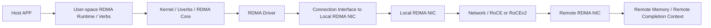
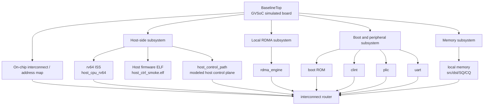
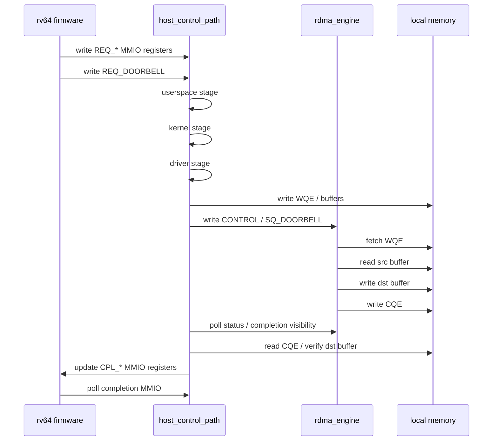
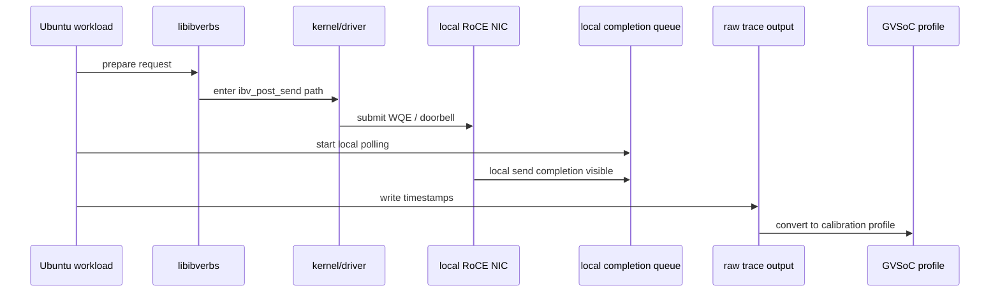

# Work Update

## 0. Purpose

This file is a presentation-ready draft for explaining the current progress of
the SmartNIC RDMA simulation work.

The focus is:

1. what the RDMA control and data path look like conceptually
2. what has already been implemented in the current `rv64` host-centric GVSoC
   baseline
3. what the current CLI output proves
4. how calibration on a real Ubuntu node is planned

---

## 1. Sequential Flow: Real RDMA End-to-End View

The following flow explains the conceptual path of a basic RDMA operation from
the host software stack to the local NIC and then toward the remote node.



### Plain-Language Explanation

- `APP`
  - the application decides to issue a communication operation
- `User-space RDMA Runtime / Verbs`
  - the app uses RDMA APIs such as verbs to describe the request
- `Kernel / Uverbs / RDMA Core`
  - the software stack crosses into the OS path that interacts with the RDMA
    subsystem
- `RDMA Driver`
  - the driver builds queue entries and prepares the hardware-facing request
- `Connection Interface to Local RDMA NIC`
  - this is the host-to-device control interface, such as MMIO/doorbell/queue
    submission
- `Local RDMA NIC`
  - the NIC consumes the request and executes the operation
- `Network / RoCE / RoCEv2`
  - the request is carried over the network fabric
- `Remote RDMA NIC`
  - the remote NIC receives the operation
- `Remote Memory / Completion Context`
  - the remote-side memory is accessed according to the RDMA operation

### Why This Flow Matters

This full flow is useful because it separates:

- the host-side control overhead
- the host-to-NIC submission overhead
- the actual network/data-path behavior

Our current simulation work is primarily targeting the first two parts.

---

## 2. What Has Been Implemented in the Current rv64 Host-Centric Baseline

### 2.1 Current Implemented System



### Hardware-Oriented Interpretation

This diagram is organized as if we were describing a board-level hardware
platform rather than a software call stack.

- `BaselineTop`
  - the complete simulated board/platform
- `Host-side subsystem`
  - the host CPU plus the modeled host control logic
- `On-chip interconnect / address map`
  - the routing fabric that connects masters and slaves
- `Local RDMA subsystem`
  - the NIC-side execution block that consumes requests
- `Memory subsystem`
  - the storage for queues and payload buffers
- `Boot and peripheral subsystem`
  - the support blocks needed to boot and run the `rv64` CPU model

This viewpoint is useful in a presentation because it shows the simulation as a
composed hardware system with clear subsystem boundaries.

### 2.2 Implemented Modules, Their Functions, and Why They Exist

#### [baseline_target.py](/home/kunq/smartnic_infra_sim/gvsoc/smartnic_rdma/host_centric_baseline/baseline_target.py)

Function:

- builds the whole GVSoC platform
- instantiates the `rv64` ISS
- maps memory and MMIO regions
- connects `host_control_path` and `rdma_engine`

Purpose:

- provides a reproducible system-level baseline
- lets us run the same control path repeatedly under fixed timing assumptions

Why this module is needed:

- without a top-level target, there is no controlled environment for comparing
  later designs such as MCU-offload or ISA extensions

#### [firmware/host_ctrl_smoke/main.c](/home/kunq/smartnic_infra_sim/gvsoc/smartnic_rdma/host_centric_baseline/firmware/host_ctrl_smoke/main.c)

Function:

- runs on the `rv64` ISS
- writes request fields into `host_control_path` MMIO
- rings the request doorbell
- polls completion
- records per-iteration cycle counts

Purpose:

- serves as a minimal host-side software workload
- makes the host control path explicit and measurable

Why this module is needed:

- we need a real CPU execution context, not just a pure behavioral stub
- it allows us to separate software execution overhead from purely modeled
  timing stages

#### [host_control_path.cpp](/home/kunq/smartnic_infra_sim/gvsoc/smartnic_rdma/host_centric_baseline/host_control_path.cpp)

Function:

- exposes a CPU-facing MMIO contract
- receives request parameters from firmware
- walks the request through staged host-side timing layers
- writes WQE-like data into memory
- issues RDMA engine control MMIO
- polls for completion
- delivers completion back to firmware through MMIO-visible registers

Purpose:

- models the host-side control plane in a structured way

Why this module is needed:

- the real host software stack is too complex to model all at once
- this module gives us a controlled decomposition of host overhead into layers

What data it helps extract:

- user-space request cost
- kernel dispatch cost
- driver preparation cost
- PCIe/control-submit cost
- completion-return cost

#### [host_control_path_comp.py](/home/kunq/smartnic_infra_sim/gvsoc/smartnic_rdma/host_centric_baseline/host_control_path_comp.py)

Function:

- defines configurable timing knobs for each staged layer

Purpose:

- lets us tune the simulation using calibration profiles

Why this module is needed:

- calibration must be adjustable without rewriting the C++ model

What data it helps extract:

- explicit cycle buckets that can later be fitted to measurements from a real
  Linux node

#### [rdma_engine.cpp](/home/kunq/smartnic_infra_sim/gvsoc/smartnic_rdma/host_centric_baseline/rdma_engine.cpp)

Function:

- consumes the queue entry
- performs the data movement
- writes a completion queue entry

Purpose:

- provides the simulated NIC-side execution engine

Why this module is needed:

- it keeps the data path separate from the host control path

What data it helps extract:

- functional correctness of request execution
- relationship between host submission and local completion visibility

#### local memory

Function:

- stores source buffer, destination buffer, submission queue, and completion
  queue

Purpose:

- provides a unified memory-backed environment for both host and RDMA engine

Why this module is needed:

- it makes queue semantics and payload movement observable and debuggable

### 2.3 Why This Particular Modular Structure Was Chosen

The modular design is deliberate.

We want to answer:

- how much of the total overhead comes from host software/control
- how much comes from the local submission path
- how much remains once the data-plane action itself is kept fixed

So the system was split into:

- a real `rv64` CPU and firmware
- a structured host control-path model
- a separate RDMA execution engine
- a shared memory-backed queue model

This gives us a clean baseline for later comparison against:

- MCU-offloaded control
- MCU-offloaded control with ISA extensions

---

## 3. Sequential Flow Inside the Current rv64 Host-Centric Baseline



### What This Flow Already Lets Us Measure

- end-to-end host-visible latency in simulation cycles
- per-layer control-path timing contribution
- request correctness
- completion correctness

---

## 4. What the Current CLI Output Already Proves

Representative successful output looks like:

```text
[rv64_fw] host_control_path latency loop start
[host_ctrl] userspace: opcode=1 src=0x10000 dst=0x20000 len=128 user_id=4660
[host_ctrl] kernel: dispatch request user_id=4660
[host_ctrl] driver: build WQE opcode=1 src=0x10000 dst=0x20000 len=128 user_id=4660
[host_ctrl] wqe readback: opcode=1 src=0x10000 dst=0x20000 len=128 user_id=4660
[host_ctrl] pcie: issue CONTROL and SQ doorbell user_id=4660
[rdma_engine] mmio CONTROL write: value=0x1
[rdma_engine] mmio SQ_DOORBELL write: value=0x1
[rdma_engine] fetch_wqe: sq=0x1000 req_status=0 opcode=1 src=0x10000 dst=0x20000 len=128 user_id=4660
[rdma_engine] perform_copy: src=0x10000 dst=0x20000 len=128 rd_status=0 wr_status=0
[rdma_engine] write_cqe: cq=0x2000 status=0 bytes=128 user_id=4660 req_status=0
[host_ctrl] pcie: completion visible for user_id=4660
[host_ctrl] driver: completion user_id=4660 buffers_ok=1 cqe_ok=1 status=0x0 bytes=128
[host_ctrl] kernel: return completion user_id=4660 status=0 bytes=128
[host_ctrl] userspace: completion delivered user_id=4660 bytes=128
[rv64_fw] iter 1 cycles=57
[rv64_fw] summary iterations=4 avg_cycles=57 min_cycles=57 max_cycles=57
[rv64_fw] PASS
```

### What This Means

#### We have a real CPU-driven control path

- the `rv64` ISS is running firmware
- the firmware is programming MMIO registers
- the host is no longer just a pure behavioral stub

#### The host control path is layered and visible

- userspace
- kernel
- driver
- PCIe/control-submit
- completion return path

These are all now explicitly represented in the simulation output.

#### The request is functionally correct

- the WQE is written correctly
- the RDMA engine fetches the expected request
- the data copy completes
- the CQE is generated
- destination buffer and CQE checks pass

#### We already have measurable host-visible latency

- the firmware reports per-iteration cycles
- for the current default setup, it is deterministic
- example: `57` cycles

### What Has Been Achieved So Far

At this point, the project has achieved:

- a runnable `rv64`-driven host-centric baseline in GVSoC
- explicit host-side control-plane staging
- explicit host-to-engine submission flow
- explicit local completion flow
- cycle-level observability from the host CPU perspective
- a calibration hook for replacing default timing with measured profiles

### What Still Needs to Be Done

The next important directions are:

- calibrate current host-control timing buckets against a real Linux node
- migrate the “real-world” calibration target from generic RDMA toward RoCE /
  RoCEv2
- improve the realism of NIC-side timing where needed
- create the next comparison case:
  - MCU-offloaded control
- later compare:
  - host-centric baseline
  - MCU-offload baseline
  - MCU-offload with ISA extensions

---

## 5. Current Calibration Plan for a Real Ubuntu Node

### 5.1 Goal

For a real Ubuntu node, the goal is:

- not to measure full network performance
- not to prioritize remote-node response time
- but to extract the host-side overhead of submitting a basic RDMA operation
  into the local NIC/queue path

This matches the simulator’s current focus.

### 5.2 Calibration Strategy Overview

```mermaid
flowchart LR
    APP[Ubuntu App / Benchmark] --> VERBS[libibverbs / RoCE runtime]
    VERBS --> KDRV[Kernel + RDMA Driver]
    KDRV --> NIC[Local RoCE NIC / Soft-RoCE]
    NIC --> LCQ[Local Send CQ Visibility]
    LCQ --> TRACE[Raw Timestamp Trace]
    TRACE --> CONV[convert_calibration.py]
    CONV --> JSON[Calibration Profile JSON]
    JSON --> SIM[GVSoC host_control_path timing buckets]
```



### 5.3 Sequential Flow for the Real-Node Calibration Plan



### 5.4 Practical Calibration Tiers

#### Tier 1: Local Approximation

Files:

- [local_ctrl_smoke.py](/home/kunq/smartnic_infra_sim/gvsoc/smartnic_rdma/host_centric_baseline/real_board_calib/local_ctrl_smoke.py)
- [test.c](/home/kunq/smartnic_infra_sim/gvsoc/smartnic_rdma/host_centric_baseline/real_board_calib/test.c)
- [test_eventfd.c](/home/kunq/smartnic_infra_sim/gvsoc/smartnic_rdma/host_centric_baseline/real_board_calib/test_eventfd.c)

Purpose:

- quickly validate the trace format and calibration flow
- approximate the host control path without requiring RDMA hardware

#### Tier 2: Real RoCE Submission Path

Files:

- [ubuntu_rdma_submit_plan.md](/home/kunq/smartnic_infra_sim/gvsoc/smartnic_rdma/host_centric_baseline/real_board_calib/ubuntu_rdma_submit_plan.md)
- [test_verbs_submit.c](/home/kunq/smartnic_infra_sim/gvsoc/smartnic_rdma/host_centric_baseline/real_board_calib/test_verbs_submit.c)

Purpose:

- extract timing from a real `libibverbs`-based RoCE submit path
- focus on local host-side submission overhead rather than remote completion

### 5.5 What We Want to Measure on the Ubuntu Node

The important timestamps are:

- app begins request preparation
- enter `ibv_post_send()`
- return from `ibv_post_send()`
- first local CQ poll
- local CQE becomes visible
- userspace completes the request-handling step

### 5.6 Expected Output of Calibration

The calibration flow should ultimately produce a JSON profile for:

- `userspace_req_cycles`
- `kernel_req_cycles`
- `driver_prepare_cycles`
- `pcie_submit_cycles`
- `poll_interval_cycles`
- `pcie_completion_cycles`
- `driver_completion_cycles`
- `kernel_completion_cycles`
- `userspace_completion_cycles`

These values are then fed back into the simulation through:

- [host_control_path_comp.py](/home/kunq/smartnic_infra_sim/gvsoc/smartnic_rdma/host_centric_baseline/host_control_path_comp.py)
- `HOST_CALIBRATION_PROFILE=...`

---

## 6. Summary for Presentation

### Main Progress

- A runnable `rv64` host-centric GVSoC baseline has been built.
- The host control path has been decomposed into user/kernel/driver/PCIe-like
  layers.
- The firmware-driven path is already producing stable latency samples.
- The RDMA engine path is functionally correct for the current local
  `RDMA_WRITE`-style baseline.
- A calibration framework has been prepared for mapping real-node measurements
  back into simulator timing parameters.

### Main Message

The current work is not “just a smoke test” anymore.

It is already a structured host-centric baseline that can be used to:

- measure host-visible control-path latency
- compare future offload designs fairly
- support calibrated timing models instead of purely hand-picked constants

### Next Message

The next major milestone is:

- calibrate this baseline against a real Ubuntu RoCE submission path

After that, the natural next comparison is:

- host-centric baseline
- MCU-offloaded baseline
- MCU-offloaded baseline with ISA extensions
